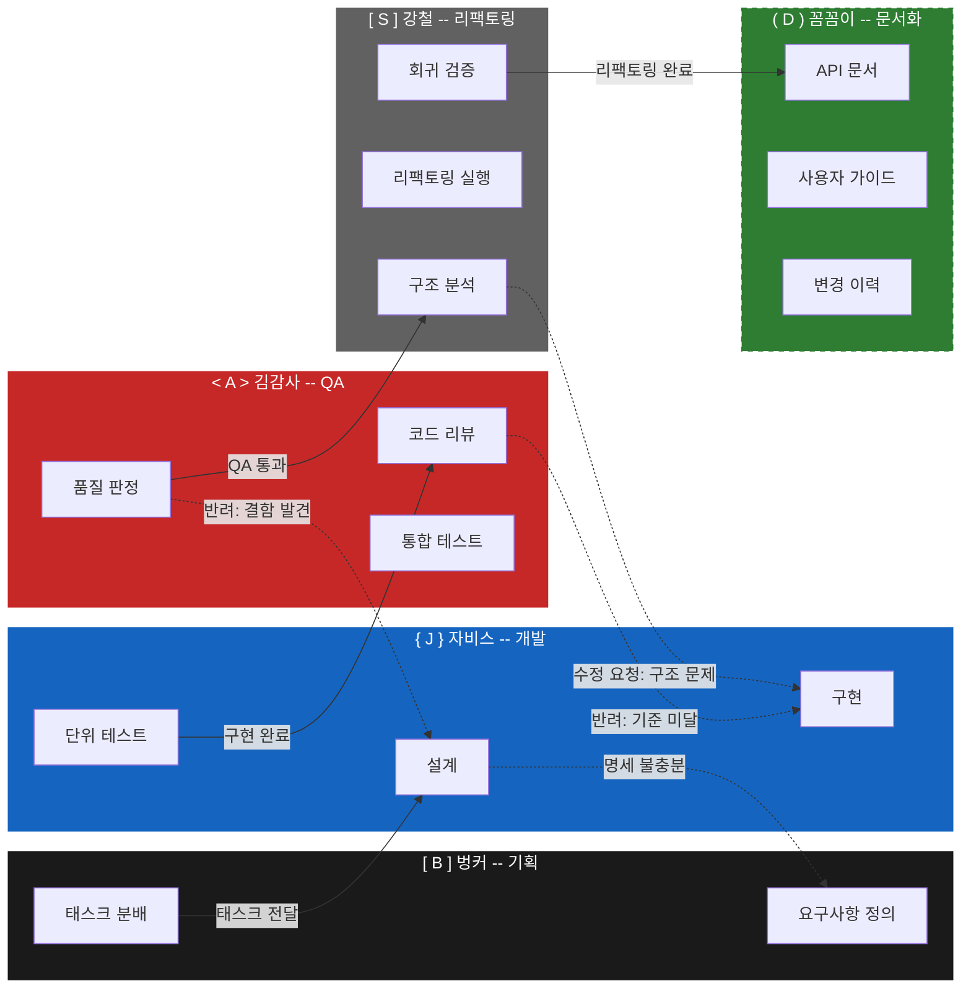
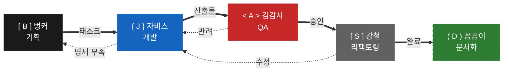
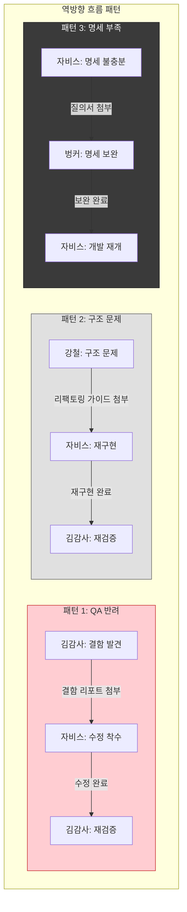
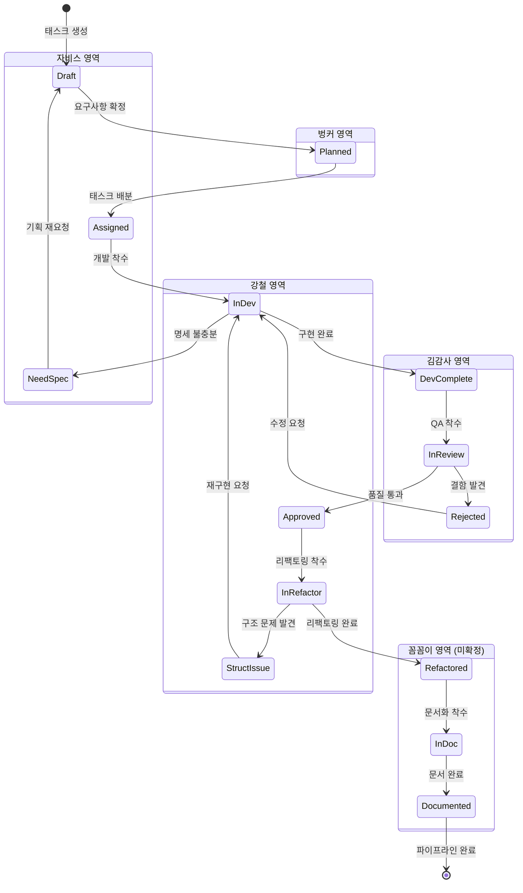

# 멀티팀 자동화 파이프라인 프로토콜 설계

## 1. 개요 및 목적

### 1.1 배경

멀티팀 환경에서 AI 에이전트 기반 태스크를 체계적으로 관리하고, 팀 간 핸드오프를 자동화하기 위한 파이프라인 프로토콜을 정의한다.

### 1.2 목적

- 팀 간 태스크 흐름을 표준화하여 병목과 누락을 방지
- 상태 전이와 핸드오프를 명확히 정의하여 자동화 기반 마련
- Phase C 구현 시 자비스팀이 즉시 착수할 수 있는 수준의 명세 제공

### 1.3 적용 범위

본 프로토콜은 5개 팀 간의 태스크 라이프사이클 전체를 다룬다.

---

## 2. 팀 구성 및 역할

| 팀 | 팀 코드 | 역할 | 에이전트 예시 | 비고 |
|---|---|---|---|---|
| **벙커(BUNKER)팀** | `BUNKER` | 기획, 위임, 총괄 PM | 송PO, 정DA, 김작가 등 | 현재 Phase B 수행 중 |
| **자비스(JARVIS)팀** | `JARVIS` | 개발, 구현 | 자비스 | Phase C 담당 |
| **김감사팀** | `KIMQA` | QA, 테스트 검증 | 김감사 | |
| **강철팀** | `KANGCHUL` | 리팩토링, 보안, 성능 | 강철 | |
| **꼼꼼이팀** | `KKOMKKOM` | 문서화 | 꼼꼼이 | GitHub 미등록 (스텁 인터페이스) |

---

## 3. 파이프라인 흐름도

> 출처: T-B03(최AR) 파이프라인 시각화 다이어그램

### 3.1 팀별 비주얼 정의

| 팀 | 팀 코드 | HEX (Primary) | HEX (Light/BG) | 아이콘 |
|---|---|---|---|---|
| 벙커 | `BUNKER` | `#1A1A1A` | `#3A3A3A` | `[ B ]` |
| 자비스 | `JARVIS` | `#1565C0` | `#BBDEFB` | `{ J }` |
| 김감사 | `KIMQA` | `#C62828` | `#FFCDD2` | `< A >` |
| 강철 | `KANGCHUL` | `#616161` | `#E0E0E0` | `[ S ]` |
| 꼼꼼이 | `KKOMKKOM` | `#2E7D32` | `#C8E6C9` | `( D )` |

**흐름 화살표 컬러:**
- 정상 흐름(Forward): `#1B5E20` / 역방향 흐름(Reject): `#E65100` / 대기: `#9E9E9E` / 에러: `#B71C1C`

### 3.2 메인 파이프라인 흐름도



### 3.3 간소화 버전 (Overview)



### 3.4 역방향 흐름 상세 (Rejection Paths)



---

## 4. 상태 전이 정의

> 출처: T-B01(정DA) 섹션 2, 4

### 4.1 전체 상태값 목록 (18개)

| # | 상태 코드 | 소유 팀 | 설명 |
|---|---|---|---|
| 1 | `PLAN_PENDING` | BUNKER | 기획 대기 |
| 2 | `PLAN_IN_PROGRESS` | BUNKER | 기획 진행 중 |
| 3 | `PLAN_REVISION` | BUNKER | 기획 재검토 (반려됨) |
| 4 | `DEV_PENDING` | JARVIS | 개발 대기 |
| 5 | `DEV_IN_PROGRESS` | JARVIS | 개발 진행 중 |
| 6 | `DEV_REVISION` | JARVIS | 개발 수정 (반려됨) |
| 7 | `QA_PENDING` | KIMQA | QA 대기 |
| 8 | `QA_IN_PROGRESS` | KIMQA | QA 진행 중 |
| 9 | `QA_REVISION` | KIMQA | QA 재검증 (반려됨) |
| 10 | `HARDEN_PENDING` | KANGCHUL | 하드닝 대기 |
| 11 | `HARDEN_IN_PROGRESS` | KANGCHUL | 하드닝 진행 중 |
| 12 | `HARDEN_REVISION` | KANGCHUL | 하드닝 재확인 (반려됨) |
| 13 | `DOC_PENDING` | KKOMKKOM | 문서화 대기 |
| 14 | `DOC_IN_PROGRESS` | KKOMKKOM | 문서화 진행 중 |
| 15 | `DEPLOY_READY` | BUNKER | 배포 준비 완료 |
| 16 | `DONE` | - | 완료 |
| 17 | `ON_HOLD` | - | 보류 |
| 18 | `CANCELLED` | - | 취소 |

### 4.2 정방향 상태 흐름 (Happy Path)

```
[PLAN_PENDING]       벙커가 태스크 수신 대기
       |
       v
[PLAN_IN_PROGRESS]   벙커가 기획/분석 중
       |
       v
[DEV_PENDING]        자비스 개발 대기 큐 진입
       |
       v
[DEV_IN_PROGRESS]    자비스 개발 중
       |
       v
[QA_PENDING]         김감사 QA 대기 큐 진입
       |
       v
[QA_IN_PROGRESS]     김감사 QA 수행 중
       |
       v
[HARDEN_PENDING]     강철 리팩토링/보안/성능 대기
       |
       v
[HARDEN_IN_PROGRESS] 강철 작업 중
       |
       v
[DOC_PENDING]        꼼꼼이 문서화 대기
       |
       v
[DOC_IN_PROGRESS]    꼼꼼이 문서화 중
       |
       v
[DEPLOY_READY]       배포 준비 완료 -> 벙커(송PO) 최종 승인
       |
       v
[DONE]               완료/배포됨
```

### 4.3 정방향 전이 테이블

| 현재 상태 | 트리거 액션 | 다음 상태 | 소유권 이동 |
|---|---|---|---|
| `PLAN_PENDING` | 벙커가 태스크 픽업 | `PLAN_IN_PROGRESS` | BUNKER 유지 |
| `PLAN_IN_PROGRESS` | 벙커 기획 완료 | `DEV_PENDING` | BUNKER -> JARVIS |
| `DEV_PENDING` | 자비스가 태스크 픽업 | `DEV_IN_PROGRESS` | JARVIS 유지 |
| `DEV_IN_PROGRESS` | 자비스 개발 완료 | `QA_PENDING` | JARVIS -> KIMQA |
| `QA_PENDING` | 김감사가 태스크 픽업 | `QA_IN_PROGRESS` | KIMQA 유지 |
| `QA_IN_PROGRESS` | 김감사 QA 통과 | `HARDEN_PENDING` | KIMQA -> KANGCHUL |
| `HARDEN_PENDING` | 강철이 태스크 픽업 | `HARDEN_IN_PROGRESS` | KANGCHUL 유지 |
| `HARDEN_IN_PROGRESS` | 강철 하드닝 완료 | `DOC_PENDING` | KANGCHUL -> KKOMKKOM |
| `DOC_PENDING` | 꼼꼼이가 태스크 픽업 | `DOC_IN_PROGRESS` | KKOMKKOM 유지 |
| `DOC_IN_PROGRESS` | 꼼꼼이 문서화 완료 | `DEPLOY_READY` | KKOMKKOM -> BUNKER |
| `DEPLOY_READY` | 벙커(송PO) 최종 승인 | `DONE` | BUNKER -> (없음) |

### 4.4 역방향 전이 (반려/수정 요청)

| 현재 상태 | 반려 사유 | 다음 상태 | 소유권 이동 | 비고 |
|---|---|---|---|---|
| `QA_IN_PROGRESS` | 버그/결함 발견 | `DEV_REVISION` | KIMQA -> JARVIS | 자비스 수정 후 -> `QA_PENDING` |
| `HARDEN_IN_PROGRESS` | 구조적 결함, 성능 이슈 | `DEV_REVISION` | KANGCHUL -> JARVIS | 자비스 수정 후 -> `QA_PENDING` (QA 재통과 필수) |
| `HARDEN_IN_PROGRESS` | 테스트 커버리지 부족 | `QA_REVISION` | KANGCHUL -> KIMQA | 김감사 보강 후 -> `HARDEN_PENDING` |
| `DOC_IN_PROGRESS` | 스펙 불일치 | `HARDEN_REVISION` | KKOMKKOM -> KANGCHUL | 강철 재확인 후 -> `DOC_PENDING` |
| `DEPLOY_READY` | 기획 방향 변경 | `PLAN_REVISION` | BUNKER -> BUNKER | 벙커 재기획 후 -> `DEV_PENDING` |

### 4.5 REVISION 상태 완료 후 재진입 규칙

| REVISION 상태 | 수정 완료 후 진입 상태 | 근거 |
|---|---|---|
| `PLAN_REVISION` | `DEV_PENDING` | 기획 변경이므로 개발부터 재시작 |
| `DEV_REVISION` | `QA_PENDING` | 코드 변경이므로 QA부터 재검증 |
| `QA_REVISION` | `HARDEN_PENDING` | 테스트 보강 후 하드닝 재진입 |
| `HARDEN_REVISION` | `DOC_PENDING` | 스펙 확정 후 문서화 재진입 |

**수정(REVISION) 상태 처리 원칙:**
- `*_REVISION` 상태에서 수정 완료 시, 해당 팀의 `*_PENDING`이 아닌 **다음 팀의 `*_PENDING`**으로 재진입
- 반복 수정 횟수는 `revision_count` 필드로 추적
- `revision_count`가 3회 초과 시 에스컬레이션

### 4.6 특수 전이

| 현재 상태 | 트리거 | 다음 상태 | 비고 |
|---|---|---|---|
| (모든 상태) | 벙커(송PO) 판단 | `ON_HOLD` | 외부 의존 대기 등 |
| (모든 상태) | 벙커(송PO) 판단 | `CANCELLED` | 태스크 폐기 |
| `ON_HOLD` | 재개 조건 충족 | (이전 상태) | 보류 전 상태로 복귀 |

### 4.7 상태 전이 다이어그램

> 출처: T-B03(최AR) 상태 다이어그램 + T-B01(정DA) 상태 흐름



---

## 5. JSON 태스크 패키지 스키마

> 출처: T-B01(정DA) 섹션 5

### 5.1 스키마 정의

`payload_json` 열(시트 P열)에 저장되는 구조화된 태스크 패키지이다.

```json
{
  "$schema": "task_package_v1",
  "schema_version": "1.0.0",
  "task_package": {
    "task_id": "TASK-20260228-001",
    "title": "슬랙 모달 에러 수정 v2",
    "status": "DEV_PENDING",
    "priority": "P1_HIGH",
    "created_by": "song-po",
    "created_at": "2026-02-28T14:30:00+09:00",
    "updated_at": "2026-02-28T15:00:00+09:00",
    "assigned_team": "JARVIS",
    "assigned_agent": "jarvis",
    "revision_count": 0,
    "dependencies": [],
    "tags": ["slack", "bugfix"],

    "pipeline_history": [
      {
        "seq": 1,
        "from_status": "PLAN_PENDING",
        "to_status": "PLAN_IN_PROGRESS",
        "actor": "song-po",
        "team": "BUNKER",
        "timestamp": "2026-02-28T14:30:00+09:00",
        "note": "태스크 착수"
      }
    ],

    "team_payloads": {
      "BUNKER": {
        "phase": "planning",
        "input": {
          "request": "슬랙 모달 에러 2.0 기획서대로 수정",
          "spec_ref": "gdrive://docs/slack_modal_spec_v2.md",
          "acceptance_criteria": [
            "모달 열림/닫힘 정상 동작",
            "에러 메시지 사용자 친화적 표시",
            "기존 데이터 유실 없음"
          ]
        },
        "output": {
          "plan_doc_ref": "gdrive://docs/plan_slack_modal_v2.md",
          "estimated_complexity": "medium"
        }
      },
      "JARVIS": {
        "phase": "development",
        "input": {
          "plan_ref": "gdrive://docs/plan_slack_modal_v2.md",
          "target_files": ["src/slack/modal_handler.gs", "src/slack/error_display.gs"]
        },
        "output": {
          "code_ref": null,
          "commit_hash": null,
          "dev_notes": null
        }
      },
      "KIMQA": {
        "phase": "qa",
        "input": { "code_ref": null, "test_scope": null },
        "output": { "qa_report_ref": null, "bugs_found": [], "verdict": null }
      },
      "KANGCHUL": {
        "phase": "hardening",
        "input": { "code_ref": null, "qa_report_ref": null },
        "output": { "refactor_ref": null, "security_findings": [], "performance_report": null }
      },
      "KKOMKKOM": {
        "phase": "documentation",
        "input": { "code_ref": null, "refactor_ref": null },
        "output": { "doc_ref": null, "changelog_entry": null },
        "_note": "꼼꼼이팀 GitHub 미등록. 인터페이스만 정의, 상세 보류."
      }
    }
  }
}
```

### 5.2 필드 명세

| 필드 | 타입 | 필수 | 설명 |
|---|---|---|---|
| `task_id` | string | Y | `TASK-YYYYMMDD-NNN` 형식 |
| `title` | string | Y | 태스크 제목 |
| `status` | enum | Y | 18개 상태값 중 하나 (섹션 4.1 참조) |
| `priority` | enum | Y | `P0_CRITICAL` / `P1_HIGH` / `P2_MEDIUM` / `P3_LOW` |
| `created_by` | string | Y | 생성자 ID |
| `created_at` | ISO 8601 | Y | 생성 타임스탬프 |
| `updated_at` | ISO 8601 | Y | 최종 수정 타임스탬프 |
| `assigned_team` | enum | Y | 5개 팀 코드 (`BUNKER` / `JARVIS` / `KIMQA` / `KANGCHUL` / `KKOMKKOM`) |
| `assigned_agent` | string | N | 팀 내 담당 에이전트 |
| `revision_count` | integer | Y | 반려 횟수 (기본값 0, 3회 초과 시 에스컬레이션) |
| `dependencies` | string[] | N | 선행 태스크 ID 배열 |
| `tags` | string[] | N | 분류 태그 |
| `pipeline_history` | object[] | Y | 상태 전이 이력 (감사 추적용) |
| `pipeline_history[].seq` | integer | Y | 전이 순번 |
| `pipeline_history[].from_status` | string | Y | 이전 상태 |
| `pipeline_history[].to_status` | string | Y | 변경 상태 |
| `pipeline_history[].actor` | string | Y | 변경 수행자 |
| `pipeline_history[].team` | string | Y | 변경 수행 팀 |
| `pipeline_history[].timestamp` | ISO 8601 | Y | 변경 시각 |
| `pipeline_history[].note` | string | N | 변경 사유/메모 |
| `team_payloads` | object | Y | 팀별 입출력 데이터 |
| `team_payloads.*.phase` | string | Y | 팀 담당 단계명 |
| `team_payloads.*.input` | object | N | 해당 팀의 입력 데이터 |
| `team_payloads.*.output` | object | N | 해당 팀의 산출물 데이터 |

### 5.3 유효성 검증 규칙

- `task_id`는 `TASK-YYYYMMDD-NNN` 정규식 패턴과 일치해야 함
- `status`는 섹션 4.1의 18개 상태값 중 하나여야 함
- `assigned_team`은 5개 팀 코드 중 하나여야 함
- `priority`는 4개 우선순위 중 하나여야 함
- `pipeline_history`는 최소 1개 이상의 전이 이력을 포함해야 함
- `revision_count` >= 0이며, 3 초과 시 에스컬레이션 플래그 설정
- `team_payloads`는 5개 팀 키를 모두 포함해야 함 (빈 객체 허용)

---

## 6. 팀 간 핸드오프 프로토콜

> 출처: T-B02(김CM) 섹션 1, 2, 6

### 6.1 핸드오프 전환점 (Handoff Points)

```
벙커(기획) -[H1]-> 자비스(개발) -[H2]-> 김감사(QA) -[H3]-> 강철(리팩토링) -[H4]-> 꼼꼼이(문서화)
```

| 전환점 | 발신팀 | 수신팀 | 트리거 조건 | status_from | status_to |
|---|---|---|---|---|---|
| H1 | 벙커(기획) | 자비스(개발) | 기획 산출물 완료 및 승인 | `PLAN_IN_PROGRESS` | `DEV_PENDING` |
| H2 | 자비스(개발) | 김감사(QA) | 개발 완료 및 빌드 성공 | `DEV_IN_PROGRESS` | `QA_PENDING` |
| H3 | 김감사(QA) | 강철(리팩토링) | QA 테스트 전체 통과 | `QA_IN_PROGRESS` | `HARDEN_PENDING` |
| H4 | 강철(리팩토링) | 꼼꼼이(문서화) | 리팩토링 완료 및 코드리뷰 통과 | `HARDEN_IN_PROGRESS` | `DOC_PENDING` |

### 6.2 핸드오프 메시지 JSON Schema

```json
{
  "$schema": "http://json-schema.org/draft-07/schema#",
  "title": "HandoffMessage",
  "description": "팀 간 태스크 핸드오프 메시지 표준 포맷",
  "type": "object",
  "required": ["handoff_id", "type", "source", "target", "task", "timestamp"],
  "properties": {
    "handoff_id": {
      "type": "string",
      "description": "고유 핸드오프 식별자 (UUID v4)",
      "pattern": "^[0-9a-f]{8}-[0-9a-f]{4}-4[0-9a-f]{3}-[89ab][0-9a-f]{3}-[0-9a-f]{12}$"
    },
    "type": {
      "type": "string",
      "enum": ["handoff", "reject", "revision_request", "ack", "escalation"],
      "description": "메시지 유형"
    },
    "source": {
      "type": "object",
      "required": ["team_id", "team_name", "agent_id"],
      "properties": {
        "team_id": { "type": "string", "description": "발신 팀 코드" },
        "team_name": { "type": "string", "description": "발신 팀 이름" },
        "agent_id": { "type": "string", "description": "발신 에이전트 ID" }
      }
    },
    "target": {
      "type": "object",
      "required": ["team_id", "team_name"],
      "properties": {
        "team_id": { "type": "string", "description": "수신 팀 코드" },
        "team_name": { "type": "string", "description": "수신 팀 이름" },
        "agent_id": { "type": "string", "description": "수신 에이전트 ID (선택)" }
      }
    },
    "task": {
      "type": "object",
      "required": ["task_id", "title", "status_from", "status_to"],
      "properties": {
        "task_id": { "type": "string" },
        "title": { "type": "string" },
        "status_from": { "type": "string", "description": "전이 전 상태 (섹션 4 상태값)" },
        "status_to": { "type": "string", "description": "전이 후 상태 (섹션 4 상태값)" },
        "priority": { "type": "string", "enum": ["P0", "P1", "P2", "P3"] },
        "artifacts": {
          "type": "array",
          "items": {
            "type": "object",
            "required": ["name", "path"],
            "properties": {
              "name": { "type": "string" },
              "path": { "type": "string" },
              "type": { "type": "string", "enum": ["document", "code", "config", "diagram", "test_result"] }
            }
          },
          "description": "전달 산출물 목록"
        },
        "context": { "type": "string", "description": "핸드오프 배경/맥락 설명" }
      }
    },
    "timestamp": { "type": "string", "format": "date-time" },
    "timeout_minutes": { "type": "integer", "default": 30, "description": "ACK 응답 제한 시간(분)" },
    "metadata": { "type": "object", "description": "확장 필드 (팀별 커스텀 데이터)" }
  }
}
```

### 6.3 수신 확인(ACK) 프로토콜

```json
{
  "handoff_id": "원본 핸드오프 ID 참조",
  "type": "ack",
  "source": { "team_id": "수신팀", "team_name": "...", "agent_id": "..." },
  "target": { "team_id": "발신팀", "team_name": "...", "agent_id": "..." },
  "task": {
    "task_id": "원본 task_id",
    "title": "원본 title",
    "status_from": "원본 status_to",
    "status_to": "원본 status_to"
  },
  "ack_status": "accepted | rejected | deferred",
  "ack_message": "수신 확인 메시지",
  "timestamp": "2026-02-28T00:00:00Z"
}
```

**ACK 규칙:**
- `accepted`: 수신 팀이 태스크 인수 확인
- `rejected`: 수신 불가 -> 반려 사유 포함, 역방향 흐름 트리거
- `deferred`: 수신 보류 -> 사유 포함, 재전송 스케줄링

### 6.4 상태 동기화 메커니즘

**동기화 원칙:**
- 모든 상태 변경은 TaskUpdate를 통해 중앙 태스크 시스템에 반영
- 핸드오프 메시지와 TaskUpdate는 원자적(atomic)으로 처리
- 상태 불일치 발생 시 핸드오프 메시지의 상태가 우선 (source of truth)

**상태 추적 흐름:**
1. 발신팀: 핸드오프 메시지 전송 + TaskUpdate(status_to)
2. 수신팀: ACK 응답 + TaskUpdate(상태 확인)
3. 반려 시: 역방향 메시지 + TaskUpdate(롤백 상태)
4. 에스컬레이션 시: 에스컬레이션 메시지 + TaskUpdate(블로커 표시)

---

## 7. 예외 처리 규칙

> 출처: T-B02(김CM) 섹션 3, 4

### 7.1 반려/수정 요청 시 역방향 흐름

**기본 원칙:**
- 반려는 직전 팀으로만 가능 (스킵 반려 금지)
- 2단계 이상 역방향 필요 시 에스컬레이션 규칙 적용
- 반려 메시지에는 반드시 `reject_reason`과 `action_items` 포함
- 반려 후 수정 완료 시 동일 `task_id`로 재핸드오프

**역방향 메시지 포맷:**

```json
{
  "handoff_id": "신규 UUID",
  "type": "reject",
  "source": { "team_id": "반려팀", "team_name": "...", "agent_id": "..." },
  "target": { "team_id": "직전팀", "team_name": "...", "agent_id": "..." },
  "task": {
    "task_id": "원본 task_id",
    "title": "원본 title",
    "status_from": "현재 상태",
    "status_to": "직전 팀 REVISION 상태로 롤백"
  },
  "reject_reason": {
    "category": "quality | scope | dependency | blocker",
    "description": "반려 상세 사유",
    "action_items": [
      {
        "assignee": "담당자",
        "action": "수정 내용",
        "deadline": "기한"
      }
    ]
  },
  "timestamp": "2026-02-28T00:00:00Z"
}
```

### 7.2 타임아웃 처리

| 단계 | 조건 | 액션 |
|---|---|---|
| 1차 알림 | ACK 제한시간 50% 경과 | 수신 팀에 리마인더 발송 |
| 2차 알림 | ACK 제한시간 100% 도달 | 수신 팀 + 송PO에게 알림 |
| 에스컬레이션 | ACK 제한시간 150% 초과 | 에스컬레이션 규칙 적용 |

**우선순위별 ACK 제한시간:**

| 우선순위 | ACK 제한시간 | 리마인더 | 에스컬레이션 |
|---|---|---|---|
| P0 (긴급) | 15분 | 7분 후 | 22분 후 |
| P1 (높음) | 30분 | 15분 후 | 45분 후 |
| P2 (보통) | 60분 | 30분 후 | 90분 후 |
| P3 (낮음) | 120분 | 60분 후 | 180분 후 |

### 7.3 에스컬레이션 경로

```
Level 1: 해당 팀 리드에게 알림 (타임아웃 150%)
Level 2: 송PO에게 에스컬레이션 (타임아웃 200% 또는 2회 연속 반려)
Level 3: 팀장(User)에게 보고 (송PO 판단)
```

**에스컬레이션 트리거:**
- ACK 타임아웃 150% 초과
- 동일 태스크 2회 연속 반려
- P0 태스크의 역방향 흐름 발생
- 2단계 이상 역방향 반려 필요
- `revision_count` 3회 초과 (섹션 4.5 참조)

### 7.4 알림 체계

**알림 채널 및 방식:**

| 채널 | 방식 | 용도 |
|---|---|---|
| SendMessage (DM) | 1:1 메시지 | 핸드오프 전달, ACK 요청, 반려 통보 |
| SendMessage (broadcast) | 전체 메시지 | 긴급 에스컬레이션, 파이프라인 중단 |
| TaskUpdate | 태스크 상태 변경 | 상태 동기화, 진행 추적 |

**알림 메시지 템플릿:**

핸드오프 알림:
```
[핸드오프] {source.team_name} -> {target.team_name}
태스크: {task.title} ({task.priority})
ACK 기한: {timeout_minutes}분 내 응답 필요
```

리마인더:
```
[리마인더] ACK 대기 중 - {task.title}
발신: {source.team_name} | 경과: {elapsed_minutes}분
즉시 응답 부탁드립니다.
```

에스컬레이션:
```
[에스컬레이션 L{level}] ACK 타임아웃 - {task.title}
발신: {source.team_name} -> 수신: {target.team_name}
경과: {elapsed_minutes}분 | 조치 필요
```

---

## 8. Agent_Tasks 시트 확장 구조

> 출처: T-B01(정DA) 섹션 3, 6

### 8.1 현행 시트 구조 (기존 2팀, 8열)

| 열 | 헤더 | 용도 |
|---|---|---|
| A | Task ID | `AGENT-001` 형식 |
| B | 상태 (Status) | 6개 상태값 |
| C | 생성자 (Author) | 팀장님 고정 |
| D | 요구사항 (Request) | 자연어 |
| E | 개발 문서 링크 / 파일 경로 | 산출물 위치 |
| F | QA 리포트 링크 / 피드백 | QA 피드백 |
| G | 현재 소유권 (Owner) | Jarvis / Kim Gamsa / 팀장님 |
| H | 수정일시 | 타임스탬프 |

**기존 구조의 한계점:**
1. 2팀(자비스, 김감사)만 지원 -- 팀 확장 시 상태값 폭발
2. 단일 피드백 열(F) -- 팀별 산출물/피드백 구분 불가
3. 의존성(dependencies) 미지원
4. 우선순위(priority) 미지원
5. 페이로드(input/output) 구조화 없음

### 8.2 확장 시트 구조 (5팀, 16열)

| 열 | 필드명 | 헤더 | 타입 | 필수 | 설명 |
|---|---|---|---|---|---|
| A | `task_id` | Task ID | string | Y | `TASK-YYYYMMDD-NNN` 형식. 자동 생성. |
| B | `title` | 제목 | string | Y | 태스크 제목 (50자 이내 권장) |
| C | `status` | 상태 | enum | Y | 18개 상태값 중 하나 |
| D | `assigned_team` | 담당팀 | enum | Y | `BUNKER` / `JARVIS` / `KIMQA` / `KANGCHUL` / `KKOMKKOM` |
| E | `assigned_agent` | 담당 에이전트 | string | N | 팀 내 실제 작업 에이전트 이름 |
| F | `priority` | 우선순위 | enum | Y | `P0_CRITICAL` ~ `P3_LOW` |
| G | `created_by` | 생성자 | string | Y | 태스크 최초 생성자 |
| H | `created_at` | 생성일시 | datetime | Y | `YYYY-MM-DD HH:mm:ss` |
| I | `updated_at` | 수정일시 | datetime | Y | 마지막 상태 변경 타임스탬프. 자동 갱신. |
| J | `dependencies` | 선행 태스크 | string | N | comma-separated task_ids |
| K | `input_ref` | 입력 참조 | string | N | 파일 경로, 문서 링크, JSON 패키지 ID |
| L | `output_ref` | 산출물 참조 | string | N | 작업 산출물 참조 |
| M | `feedback` | 피드백/사유 | string | N | 반려 사유, QA 리포트 등 (최신만 기록, 이력은 로그 시트) |
| N | `revision_count` | 수정 횟수 | integer | Y | 기본값 0. 3회 초과 시 에스컬레이션. |
| O | `tags` | 태그 | string | N | comma-separated 분류/검색용 태그 |
| P | `payload_json` | 페이로드 (JSON) | json_string | N | 구조화된 입출력 데이터 (섹션 5 스키마 참조) |

### 8.3 기존 대비 변경 요약

| 항목 | 기존 (2팀) | 확장 (5팀) |
|---|---|---|
| 컬럼 수 | 8 (A~H) | 16 (A~P) |
| 상태값 수 | 6개 | 18개 |
| 팀 구분 | Owner 열 1개로 통합 | `assigned_team` + `assigned_agent` 분리 |
| 우선순위 | 없음 | P0~P3 4단계 |
| 의존성 | 없음 | `dependencies` 열 |
| 페이로드 | 자연어(D열) | `input_ref` + `output_ref` + `payload_json` |
| 수정 추적 | 없음 | `revision_count` |
| 태그 | 없음 | `tags` 열 |

**기존 열 매핑**: A=A, B->C, C->G, D->K(input_ref), E->L(output_ref), F->M, G->D+E, H->I

### 8.4 보조 시트 구조

Agent_Tasks 시트 외에 다음 보조 시트를 권장한다.

#### 8.4.1 Agent_Task_Log (상태 전이 이력)

| 열 | 필드 | 설명 |
|---|---|---|
| A | `log_id` | 자동 증가 ID |
| B | `task_id` | 참조 태스크 ID |
| C | `from_status` | 이전 상태 |
| D | `to_status` | 변경된 상태 |
| E | `actor` | 변경 수행자 |
| F | `team` | 변경 수행 팀 |
| G | `timestamp` | 변경 시각 |
| H | `note` | 변경 사유/메모 |

#### 8.4.2 Agent_Registry (에이전트 등록부)

| 열 | 필드 | 설명 |
|---|---|---|
| A | `agent_id` | 에이전트 고유 ID |
| B | `agent_name` | 에이전트 이름 |
| C | `team` | 소속 팀 코드 |
| D | `role` | 역할 설명 |
| E | `status` | `active` / `inactive` / `pending` |
| F | `github_registered` | Y/N |

---

## 9. 꼼꼼이팀 인터페이스 (스텁)

### 9.1 개요

꼼꼼이팀은 문서화를 담당한다. 본 섹션은 꼼꼼이팀과의 인터페이스를 사전 정의하는 스텁이다.

### 9.2 문서화 요청 인터페이스

```jsonc
// STUB: 꼼꼼이팀 인터페이스 확정 시 교체
{
  "type": "documentation_request",
  "source_team": "<요청 팀>",
  "target_team": "꼼꼼이",
  "task_id": "<태스크 ID>",
  "documentation_type": "<문서화 유형>",
  "payload": {}
}
```

### 9.3 문서화 결과 인터페이스

```jsonc
// STUB: 꼼꼼이팀 인터페이스 확정 시 교체
{
  "type": "documentation_result",
  "source_team": "꼼꼼이",
  "task_id": "<태스크 ID>",
  "result": "complete | partial | revision_needed",
  "artifacts": []
}
```

### 9.4 문서화 체크리스트 (초안)

- [ ] 산출물 문서화 완료 여부
- [ ] 문서 포맷 및 구조 일관성
- [ ] 용어 통일성
- [ ] 변경 이력 반영 여부

### 9.5 H4 핸드오프 수신 인터페이스

> 출처: T-B02(김CM) 섹션 5

강철팀 -> 꼼꼼이팀 핸드오프(H4) 시 전달되는 메시지 예시:

```json
{
  "handoff_id": "UUID",
  "type": "handoff",
  "source": { "team_id": "KANGCHUL", "team_name": "강철(리팩토링)" },
  "target": { "team_id": "KKOMKKOM", "team_name": "꼼꼼이(문서화)" },
  "task": {
    "task_id": "...",
    "title": "...",
    "status_from": "HARDEN_IN_PROGRESS",
    "status_to": "DOC_PENDING",
    "artifacts": [
      { "name": "리팩토링 완료 코드", "path": "...", "type": "code" },
      { "name": "리팩토링 변경 로그", "path": "...", "type": "document" }
    ]
  }
}
```

**꼼꼼이팀 산출물 포맷 (Stub):**
- 기대 산출물: API 문서, 사용자 가이드, 변경 이력
- 문서화 완료 시 송PO에게 최종 보고 (핸드오프가 아닌 완료 보고)
- 상세 출력 포맷은 추후 확정

### 9.6 꼼꼼이팀 운영 유의사항

> 출처: T-B01(정DA) 섹션 7

- GitHub **미등록** 상태이므로 `Agent_Registry`에서 `status=pending`, `github_registered=N`으로 등록
- `DOC_PENDING` / `DOC_IN_PROGRESS` 상태 전이 로직은 구현하되, 실제 트리거는 보류
- `team_payloads.KKOMKKOM`의 인터페이스(input/output 구조)만 정의, 세부 구현은 등록 완료 후 확정
- **꼼꼼이팀 미등록 시 대체 흐름**: `HARDEN_IN_PROGRESS` -> `DEPLOY_READY` (문서화 단계 스킵 가능, 송PO 승인 필요)

> **Note**: 본 섹션은 스텁이며, 꼼꼼이팀과의 협의 후 확정 필요

---

## 10. Phase C 구현 가이드 (자비스팀 전달용)

### 10.1 구현 목표

자비스팀이 본 프로토콜을 기반으로 파이프라인 자동화를 구현한다.

### 10.2 구현 우선순위

| 순서 | 구현 항목 | 관련 섹션 | 비고 |
|---|---|---|---|
| 1 | 태스크 패키지 파서 및 유효성 검증 | 5. JSON 태스크 패키지 스키마 | |
| 2 | 상태 머신 구현 | 4. 상태 전이 정의 | |
| 3 | 핸드오프 엔진 | 6. 팀 간 핸드오프 프로토콜 | |
| 4 | 예외 처리 모듈 | 7. 예외 처리 규칙 | |
| 5 | Agent_Tasks 시트 연동 | 8. Agent_Tasks 시트 확장 구조 | |
| 6 | 꼼꼼이팀 연동 | 9. 꼼꼼이팀 인터페이스 | |

### 10.3 기술 요구사항

- 태스크 패키지는 JSON Schema(draft-07) 기반 유효성 검증 필수 (섹션 5 스키마)
- 상태 전이는 섹션 4의 명시적 전이 규칙만 허용 (암묵적 전이 금지, 18개 상태값)
- 핸드오프는 비동기 메시지 기반, UUID v4 식별자 사용 (섹션 6 스키마)
- ACK 프로토콜 구현 필수: `accepted` / `rejected` / `deferred` (섹션 6.3)
- 우선순위별 ACK 타임아웃 차등 적용 (P0: 15분 ~ P3: 120분, 섹션 7.2)
- 모든 상태 변경은 `Agent_Task_Log` 시트에 감사 로그(audit log) 기록 (섹션 8.4.1)
- 핸드오프 메시지와 TaskUpdate는 원자적(atomic) 처리 (섹션 6.4)
- `revision_count` 3회 초과 시 자동 에스컬레이션 트리거 (섹션 7.3)

### 10.4 테스트 시나리오 (초안)

| 시나리오 | 설명 | 기대 결과 |
|---|---|---|
| 정상 흐름 (Happy Path) | PLAN_PENDING -> ... -> DONE, H1~H4 핸드오프 정상 수행 | 모든 상태 전이 정상 완료, ACK accepted |
| ACK 타임아웃 | 핸드오프 후 수신 팀 ACK 미응답 | 리마인더 -> 에스컬레이션 단계적 처리 (섹션 7.2) |
| 반려 흐름 | 김감사 QA 결함 발견 -> DEV_REVISION | 역방향 메시지 + reject_reason 포함 (섹션 7.1) |
| 스키마 위반 | 잘못된 태스크 패키지 전송 | 유효성 검증 실패, 거부 응답 |
| 상태 역행 | DONE -> DEV_IN_PROGRESS 전이 시도 | 전이 거부, 오류 반환 |
| 반복 반려 | 동일 태스크 revision_count > 3 | 자동 에스컬레이션 (섹션 7.3) |
| 꼼꼼이팀 스킵 | 꼼꼼이 미등록 시 문서화 단계 생략 | HARDEN_IN_PROGRESS -> DEPLOY_READY (송PO 승인 필요) |

### 10.5 인수 체크리스트

- [ ] 본 문서의 모든 섹션이 확정 상태(draft 아님)인지 확인
- [ ] JSON 스키마 파일 별도 제공 여부 확인
- [ ] 꼼꼼이팀 스텁 인터페이스 합의 여부 확인
- [ ] 팀별 담당자 연락처 확보

---

## 부록

### A. 용어 정의

| 용어 | 정의 |
|---|---|
| 태스크 패키지 | 팀 간 전달되는 태스크 정보의 JSON 단위 (`payload_json` 열) |
| 핸드오프 | 한 팀에서 다른 팀으로 태스크를 이관하는 행위 (소유권 이동 수반) |
| 상태 전이 | 태스크의 라이프사이클 상태가 변경되는 것 (18개 상태값 간 이동) |
| 에스컬레이션 | 예외 상황 발생 시 상위 의사결정 경로로 올리는 것 (`revision_count` > 3 등) |
| 스텁 | 아직 확정되지 않은 인터페이스의 임시 정의 (꼼꼼이팀 등) |
| REVISION | 반려로 인한 수정 상태. 수정 완료 시 다음 팀의 `*_PENDING`으로 재진입 |
| 하드닝 | 리팩토링, 보안 점검, 성능 최적화를 포괄하는 강화 작업 (강철팀 담당) |
| pipeline_history | 태스크 패키지 내 상태 전이 감사 이력 배열 |
| team_payloads | 태스크 패키지 내 팀별 입출력 데이터 구조 |
| ACK | 수신 확인(Acknowledgment). 핸드오프 메시지 수신 후 응답 (`accepted`/`rejected`/`deferred`) |
| 핸드오프 메시지 | 팀 간 태스크 전달 시 사용하는 JSON 표준 포맷 (UUID v4 식별) |
| 전환점 (H1~H4) | 파이프라인에서 팀 간 핸드오프가 발생하는 4개 지점 |

### B. 변경 이력

| 버전 | 일자 | 작성자 | 변경 내용 |
|---|---|---|---|
| 0.1 | 2026-02-28 | 박DC | 문서 뼈대(skeleton) 초안 작성 |
| 0.2 | 2026-02-28 | 박DC | 팀 역할 수정(꼼꼼이→문서화, 김감사/강철팀 추가), 섹션 9 문서화 인터페이스로 변경 |
| 0.5 | 2026-02-28 | 박DC | T-B01(정DA) 산출물 통합(섹션 4, 5, 8, 9 보완), T-B03(최AR) 산출물 통합(섹션 3) |
| 1.0 | 2026-02-28 | 박DC | T-B02(김CM) 산출물 통합(섹션 6, 7), 섹션 9/10 보완, 전 섹션 통합 완료 |

---

> **문서 상태**: `complete` - T-B01(정DA), T-B02(김CM), T-B03(최AR) 전 산출물 통합 완료 (v1.0)
