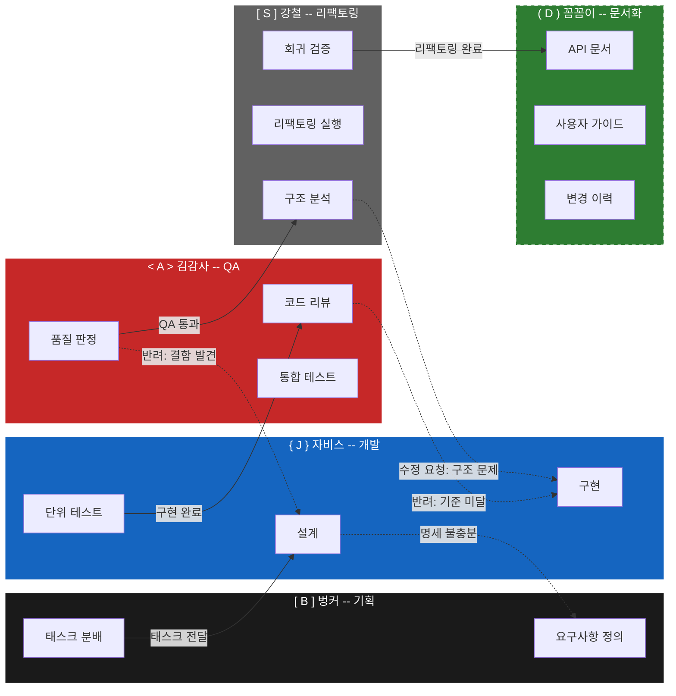

# T-B03: 파이프라인 시각화 다이어그램

> 작성: 최AR (디자인) | 우선순위: P1
> 상태: T-B01/T-B02 산출물 반영 전 기본 설계

---

## 1. 팀별 비주얼 정의 (Visual Identity)

### 1-1. 컬러 매핑

| 팀 | 역할 | HEX (Primary) | HEX (Light/BG) | 비고 |
|---|---|---|---|---|
| 벙커 BUNKER | 기획 | `#1A1A1A` | `#3A3A3A` | 블랙 계열 -- 기반, 시작점 |
| 자비스 JARVIS | 개발 | `#1565C0` | `#BBDEFB` | 블루 계열 -- 기술, 신뢰 |
| 김감사 AUDITOR | QA | `#C62828` | `#FFCDD2` | 레드 계열 -- 검증, 경고 |
| 강철 STEEL | 리팩토링 | `#616161` | `#E0E0E0` | 그레이 계열 -- 견고함, 구조 |
| 꼼꼼이 DETAIL | 문서화 | `#2E7D32` | `#C8E6C9` | 그린 계열 -- 완성, 정리 (미확정) |

### 1-2. 아이콘/이모지 매핑

| 팀 | 이모지 | 의미 |
|---|---|---|
| 벙커 | `[ B ]` | Bunker 이니셜, 방패 형상 |
| 자비스 | `{ J }` | 코드 블록 연상 |
| 김감사 | `< A >` | 검사 태그 |
| 강철 | `[ S ]` | 구조 블록 |
| 꼼꼼이 | `( D )` | 부드러운 문서 형태 (점선 = 미확정) |

### 1-3. 상태별 컬러

| 상태 | HEX | 용도 |
|---|---|---|
| 정상 흐름 (Forward) | `#1B5E20` | 진행 방향 화살표 |
| 역방향 흐름 (Reject/Revise) | `#E65100` | 반려/수정 요청 화살표 |
| 대기 (Idle) | `#9E9E9E` | 비활성 노드 |
| 에러 (Error) | `#B71C1C` | 실패/블로킹 상태 |

### 1-4. 타이포그래피 (다이어그램 내)

- 팀명: **Bold**, 14px 이상
- 설명 텍스트: Regular, 12px
- 상태 라벨: Medium, 11px, 대문자 권장
- 폰트: `Pretendard` (한글) / `JetBrains Mono` (코드/다이어그램)

---

## 2. 파이프라인 흐름도 (Pipeline Flowchart)

### 2-1. 정상 흐름 + 역방향 흐름

### 2-2. 간소화 버전 (Overview)

---

## 3. 상태 전이 다이어그램 (State Diagram)

---

## 4. 역방향 흐름 상세 (Rejection Paths)

---

## 5. 디자인 노트

### 적용 원칙
- **점선(dash)**: 꼼꼼이 팀 관련 요소 및 역방향 흐름에 사용
- **실선(solid)**: 정상 흐름, 확정된 팀 관련 요소
- **굵은 화살표(==>)**: 메인 파이프라인 흐름 (Overview)
- **얇은 점선 화살표(-.->)**: 반려/수정 요청

### Mermaid 렌더링 호환성
- GitHub Markdown: 지원
- GitLab Markdown: 지원
- VS Code (Markdown Preview Mermaid): 지원
- Notion: 미지원 (이미지 변환 필요)

### 확장 포인트
- T-B01(정DA) 산출물 수신 시: 상태 전이 다이어그램의 상태값/조건 상세화
- T-B02(김CM) 산출물 수신 시: 팀 간 인터페이스 메시지 포맷 반영

---

*최AR | 벙커 디자인팀 | v1.0-draft*
