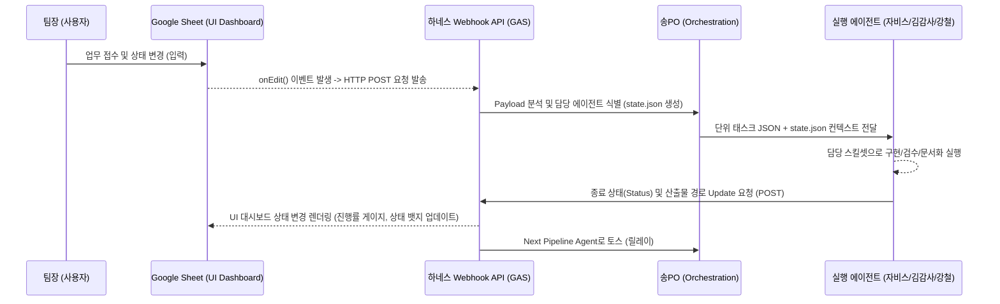

# 🏛️ [V4 핑퐁 시스템] 통합 아키텍처 및 API 명세서 (Architecture & API Spec)

---
**문서 정보**
- **작성자**: 알렉스 (Jarvis Tech Lead)
- **작성일**: 2026-02-28
- **버전**: v1.0
- **상태**: Draft
---

## 1. 시스템 아키텍처 개요 (System Architecture)

V4 시스템은 기존의 구글 시트 폴링(Polling) 방식(1분 트리거)을 버리고, **이벤트 기반(Event-driven) Webhook 아키텍처**로 완벽하게 전환합니다. 에이전트 간의 컨텍스트는 `state.json`을 통해 전달되며, 하네스(Harness) 라우터가 전체 파이프라인의 오케스트레이션을 담당합니다.

### 1.1 이벤트 기반 데이터 흐름도



## 2. 상태 관리 모듈: `state.json` Data Schema

모든 에이전트는 이 JSON 포맷을 통해 이전 에이전트의 작업 맥락을 넘겨받고, 완료 후 상태를 갱신합니다.

```json
{
  "task_id": "T-20260228-001",
  "project_name": "신규 프로젝트 (예시)",
  "current_stage": "QA_REVIEW", // enum: PLANNING, DEVELOPING, QA_REVIEW, OPTIMIZING, DOCUMENTING, DONE
  "assigned_team": "KIM_QA_TEAM",
  "pingpong_count": 1, // 최대 3회로 서킷 브레이커 제어
  "token_usage": {
    "total_budget": 1000000,
    "used": 450000
  },
  "context": {
    "prd_path": "/planning/prd_example.md",
    "code_paths": ["/src/gas/example_api.gs", "/public/example_ui.html"],
    "last_commit_hash": "a6ec83c"
  },
  "latest_qa_feedback": null // QA 반려 시 여기에 Diff 규격 JSON이 삽입됨
}
```

## 3. 동시성 제어 (Concurrency Control) 및 락 (LockService) 정책

GAS 환경 특성상 다수의 동작이 동시에 `state.json`이나 구글 시트를 업데이트할 때 충돌이 발생할 수 있습니다 (Race Condition). 이를 방지하기 위한 강제 락(Lock) 정책입니다.

1. **대상**: 상태(`state.json`)를 변경하거나 UI 대시보드(Sheet) 데이터를 업데이트하는 모든 쓰기 로직.
2. **정책**: `LockService.getScriptLock()` 강제 사용.
3. **타임아웃(Timeout)**: 최대 15초(15,000ms) 대기. 15초 초과 시 작업 큐를 백오프(Back-off) 알고리즘으로 슬립(Sleep) 후 재시도 (최대 3회).
4. **캐싱(Cache) 무효화**: 상태 변이가 성공한 즉시 `CacheService` 상의 이전 객체를 무효화(Remove)하고 갱신.

## 4. [Task 1.2] 개발/QA 간 핑퐁 통신 프로토콜 (Diff JSON Specification)

무한 핑퐁과 Hallucination을 잡기 위해, 김감사(QA)가 단순히 "여기 틀렸어 다시해"라고 말하는 것을 금지합니다.
QA가 반려할 경우, **반드시 아래와 같은 엄격한 Diff 규격의 JSON 객체**를 `state.json`의 `latest_qa_feedback` 필드에 주입하여 자비스에게 반환해야 합니다.

### 4.1 QA 반려 레포트 규격 (QA Rejection Payload)

```json
{
  "qa_status": "REJECTED",
  "pingpong_increment": true, // 카운트 +1
  "rejection_reason": "에이다 백엔드 API에서 LockService 타임아웃 처리가 누락되어 동시성 에러 발생 가능성 농후함.",
  "target_file": "/src/gas/vacation_api.gs",
  "diff_request": [
    {
      "type": "MODIFY",
      "line_range": [45, 48],
      "issue_description": "try-catch 블록이 없음. LockService.waitLock 후 에러 시 Lock이 풀리지 않는 영구 데드락 위험.",
      "suggested_fix": "finally 블록을 추가하여 lock.release()를 보장할 것."
    }
  ],
  "severity": "CRITICAL"
}
```

## 5. 서킷 브레이커 (Circuit Breaker) 규칙

- **재시도 한계**: `pingpong_count` >= 3 도달 시, 더 이상 자비스에게 반환하지 않고 `current_stage`를 `ESCALATED`로 변경함.
- **예산 통제**: `token_usage.used` 가 `token_usage.total_budget`의 90% 초과 시 자동 중지.
- **조치**: 상태가 ESCALATED가 되면, Webhook 리스너는 팀장의 개인 Slack (또는 지정 채널)으로 `[🚨 핑퐁 한계 초과 알림] 수동 개입 필요` 알림을 HTTP 발송.

---
**[Tech Lead 알렉스 코멘트]**
해당 아키텍처와 API 스키마는 **이벤트 소싱(Event Sourcing)** 시스템 설계 구조를 띄어 대규모 트래픽의 멀티 에이전트 확장성에 완벽하게 대응합니다. 이 구조에 따라 에이다(Backend)가 코드를 바로 수정할 수 있습니다.
